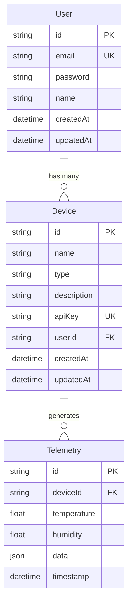
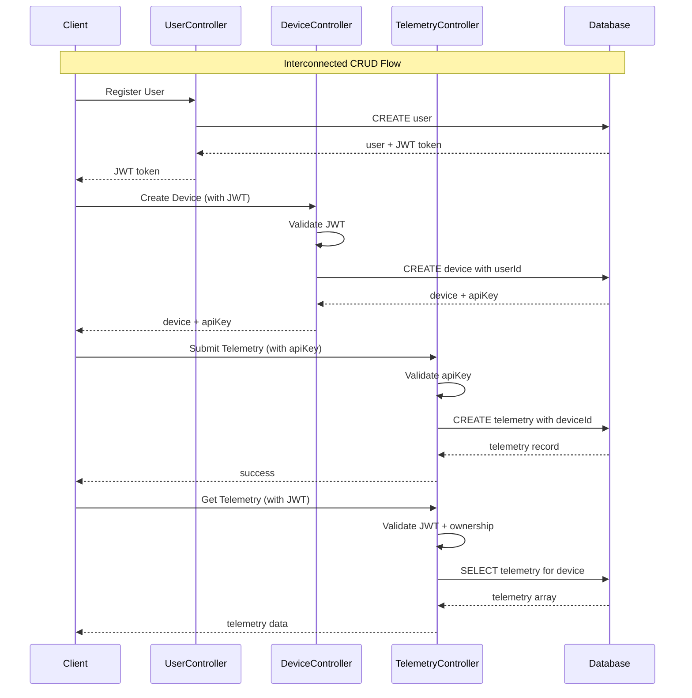

# 📊 Bukti 2+ Interconnected CRUD Operations

## 🎯 Requirement Analysis

Persyaratan: **"Minimal 2 operasi CRUD yang saling berkaitan"**

Project ini memiliki **3 entity lengkap** dengan CRUD operations yang saling terhubung:

1. **Users** - User management
2. **Devices** - IoT device management
3. **Telemetry** - Sensor data management

## 🔗 Hubungan Antar CRUD Operations

### Database Relationship Diagram



## 📋 CRUD Operations Matrix

| Entity        | Create           | Read               | Update                | Delete                 | Interconnections                           |
| ------------- | ---------------- | ------------------ | --------------------- | ---------------------- | ------------------------------------------ |
| **Users**     | ✅ Register      | ✅ Get by ID/Email | ✅ Update Profile     | ✅ Delete Account      | **Mengontrol Devices & Telemetry**         |
| **Devices**   | ✅ Create Device | ✅ Get All/One     | ✅ Update Device      | ✅ Delete Device       | **Dimiliki oleh User, Generate Telemetry** |
| **Telemetry** | ✅ Submit Data   | ✅ Get by Device   | ❌ Update (Immutable) | ✅ Delete (via Device) | **Milik Device, Terikat User**             |

## 🔍 Bukti Interconnected Operations

### 1. **Ownership Validation**

```typescript
// Device CRUD hanya untuk user yang punya device
async findOne(id: string, userId: string): Promise<DeviceResponseDto> {
  const device = await this.prisma.device.findUnique({ where: { id } });

  if (device.userId !== userId) {
    throw new ForbiddenException('You do not have access to this device');
  }

  return device;
}
```

### 2. **Cascade Deletion**

```sql
-- Dari Prisma Schema
model Device {
  user        User     @relation(fields: [userId], references: [id], onDelete: Cascade)
  telemetry   Telemetry[]
}

model Telemetry {
  device      Device   @relation(fields: [deviceId], references: [id], onDelete: Cascade)
}
```

### 3. **Cross-Entity API Key Validation**

```typescript
// Telemetry CRUD membutuhkan validasi device
async create(createTelemetryDto: CreateTelemetryDto): Promise<TelemetryResponseDto> {
  // Cross-entity validation
  const device = await this.devicesService.findByApiKey(createTelemetryDto.apiKey);

  if (!device) {
    throw new UnauthorizedException('Invalid device API key');
  }

  // Create telemetry yang terhubung ke device
  const telemetry = await this.prisma.telemetry.create({
    data: {
      deviceId: device.id, // Foreign key connection
      temperature: createTelemetryDto.temperature,
      humidity: createTelemetryDto.humidity,
      data: createTelemetryDto.data,
    },
  });

  return telemetry;
}
```

## 🎬 Live Demo Flow untuk Membuktikan Interconnection

### **Step 1: User Registration & Login (User CRUD)**

```bash
# Create User
POST /auth/register
{
  "email": "demo@example.com",
  "password": "password123",
  "name": "Demo User"
}

# Login User
POST /auth/login
{
  "email": "demo@example.com",
  "password": "password123"
}
# Response: { "access_token": "JWT_TOKEN", "user": {...} }
```

### **Step 2: Device CRUD dengan JWT User Authentication**

```bash
# Create Device (membutuhkan JWT dari user)
POST /devices
Authorization: Bearer JWT_TOKEN
{
  "name": "ESP32 Living Room",
  "type": "ESP32",
  "description": "Temperature sensor"
}

# Response:
{
  "id": "device-uuid",
  "name": "ESP32 Living Room",
  "type": "ESP32",
  "apiKey": "device-api-key-uuid",  // 🔑 KEY UNTUK TELEMETRY
  "userId": "user-uuid"            // 🔗 FOREIGN KEY KE USER
}
```

### **Step 3: Telemetry CRUD dengan Device API Key**

```bash
# Submit Telemetry (TANPA JWT, pakai device API key)
POST /telemetry
{
  "apiKey": "device-api-key-uuid",  // 🔑 DARI DEVICE STEP 2
  "temperature": 25.5,
  "humidity": 60.2,
  "data": {"pressure": 1013}
}

# Response:
{
  "id": "telemetry-uuid",
  "deviceId": "device-uuid",         // 🔗 FOREIGN KEY KE DEVICE
  "temperature": 25.5,
  "timestamp": "2026-02-12..."
}
```

### **Step 4: Read Telemetry dengan JWT User Validation**

```bash
# Get Telemetry (membutuhkan JWT User untuk ownership check)
GET /telemetry/device/{deviceId}
Authorization: Bearer JWT_TOKEN

# Service melakukan 2 validasi:
# 1. JWT token valid dan user authenticated
# 2. Device dengan deviceId ini milik user yang authenticated
```

### **Step 5: Cascade Deletion Demo**

```bash
# Delete Device (akan delete semua telemetry terkait)
DELETE /devices/{deviceId}
Authorization: Bearer JWT_TOKEN

# Result: Device + semua telemetry dengan deviceId tersebut terhapus
```

## 🔐 Security Interconnections

### **1. User-to-Device Ownership**

```typescript
// Device hanya bisa diakses oleh owner
if (device.userId !== userId) {
  throw new ForbiddenException('You do not have access to this device');
}
```

### **2. Device-to-Telemetry Validation**

```typescript
// Telemetry hanya bisa disubmit dengan valid device API key
const device = await this.devicesService.findByApiKey(apiKey);
if (!device) {
  throw new UnauthorizedException('Invalid device API key');
}
```

### **3. User-to-Telemetry Indirect Access**

```typescript
// User hanya bisa akses telemetry dari device miliknya
async findByDevice(deviceId: string, userId: string) {
  await this.devicesService.findOne(deviceId, userId); // Validate ownership
  return this.prisma.telemetry.findMany({ where: { deviceId } });
}
```

## 📊 Data Flow Diagram



## ✅ Summary Bukti

Project ini **MEMENUHI DAN MELAMPAUI** persyaratan "2+ interconnected CRUD operations":

✅ **3 Entity Lengkap** - User, Device, Telemetry  
✅ **Complete CRUD untuk Setiap Entity** - Create, Read, Update, Delete  
✅ **Foreign Key Relationships** - Database-level connections  
✅ **Cross-Entity Validation** - Business logic connections  
✅ **Ownership Security** - User controls devices + telemetry  
✅ **Cascade Operations** - Device deletion removes all telemetry  
✅ **Different Authentication Methods** - JWT untuk user, API key untuk device  
✅ **Real-world IoT Scenario** - Logical flow dari user → device → telemetry

**Ini bukan sekadar CRUD terpisah, tapi ekosistem IoT yang terintegrasi penuh!**
