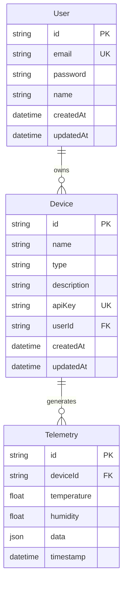
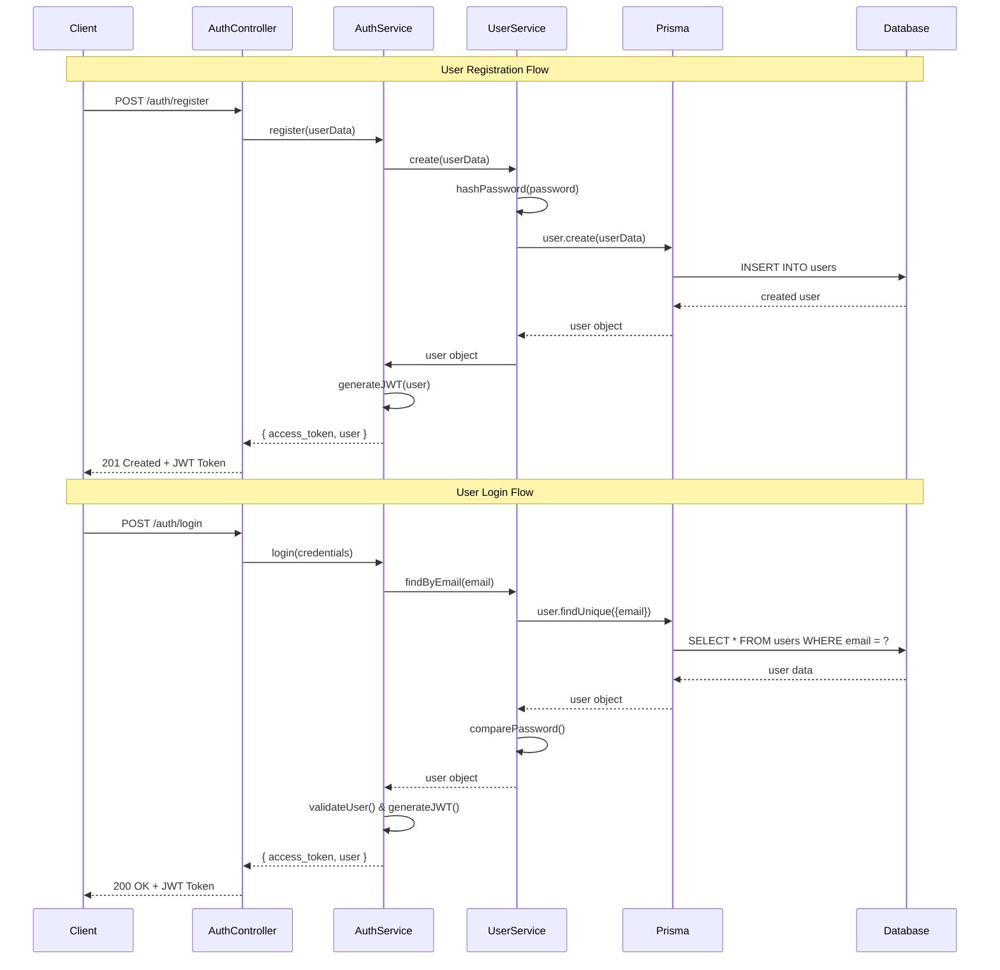
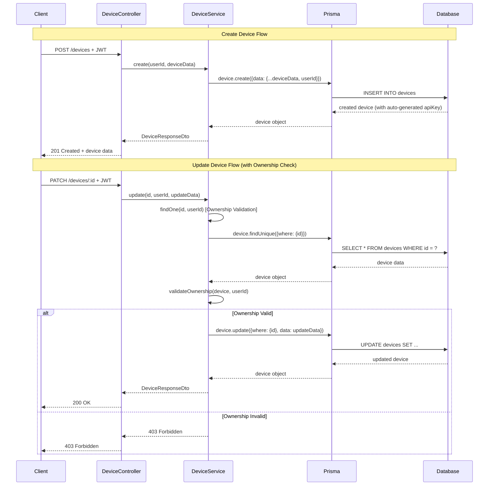
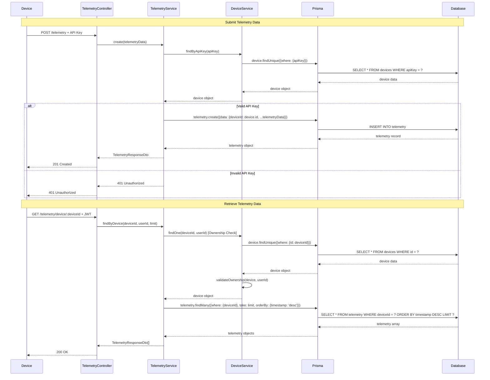
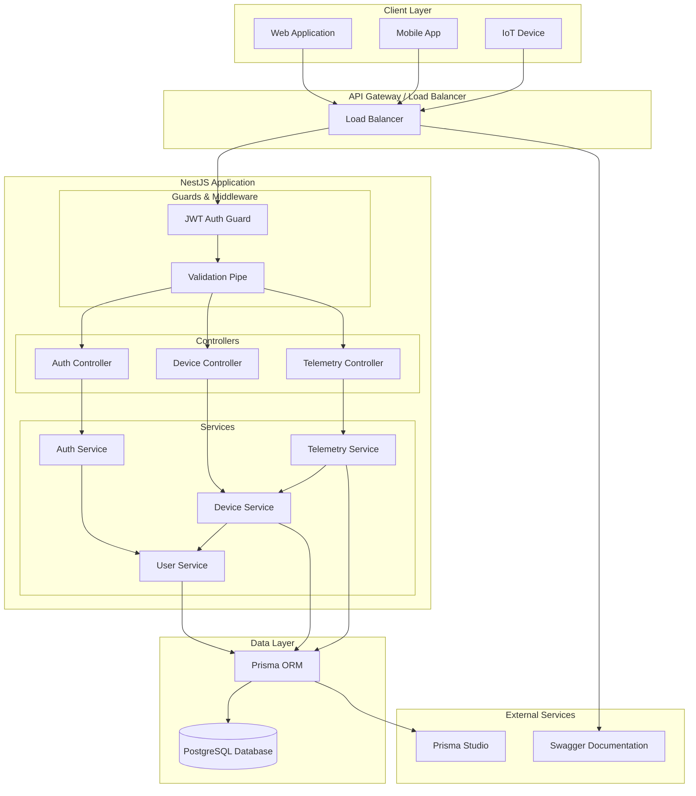
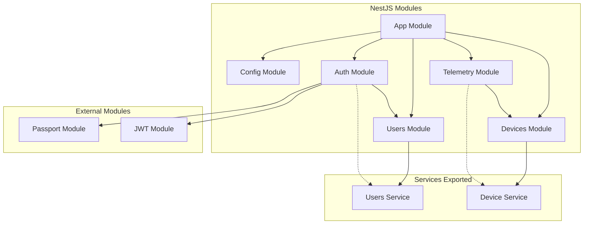
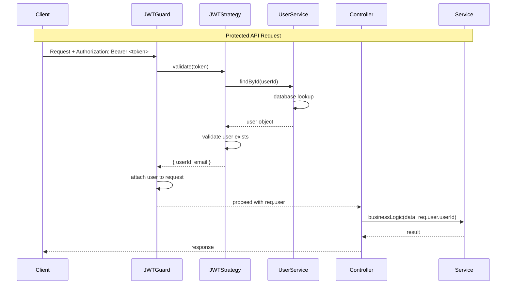

# 📊 IoT Telemetry API - UML Diagram Documentation

## 🎯 Overview
Dokumen ini berisi diagram UML (Unified Modeling Language) yang menggambarkan arsitektur database, hubungan entitas, dan alur CRUD operations pada IoT Telemetry API.

## 📈 Entity Relationship Diagram (ERD)

### Database Schema Relationships

### Penjelasan Hubungan:

1. **User ↔ Device (One-to-Many)**
   - Satu User dapat memiliki banyak Device
   - Setiap Device dimiliki oleh exactly satu User
   - Foreign Key: `userId` di tabel `devices`
   - Cascade: Jika User dihapus, semua Device miliknya ikut terhapus

2. **Device ↔ Telemetry (One-to-Many)**
   - Satu Device dapat menghasilkan banyak Telemetry data
   - Setiap Telemetry record dimiliki oleh exactly satu Device
   - Foreign Key: `deviceId` di tabel `telemetry`
   - Cascade: Jika Device dihapus, semua Telemetry data-nya ikut terhapus

## 🔄 CRUD Flow Diagrams

### 1. User Authentication Flow

### 2. Device Management Flow

### 3. Telemetry Data Flow

## 🏗️ Architecture Diagram

### System Architecture Overview

### Module Dependency Graph

## 📋 CRUD Operations Matrix

| Entity | Create | Read | Update | Delete | Authentication Required |
|--------|--------|------|--------|--------|-------------------------|
| **User** | `POST /auth/register` | N/A | N/A | `DELETE /auth/account` | JWT (Delete only) |
| **Device** | `POST /devices` | `GET /devices` `GET /devices/:id` | `PATCH /devices/:id` | `DELETE /devices/:id` | JWT Token |
| **Telemetry** | `POST /telemetry` | `GET /telemetry/device/:id` | N/A | N/A | API Key (Create) JWT (Read) |

## 🔒 Security Flow Diagram

## 🎯 Key Design Patterns

### 1. Repository Pattern (via Prisma)
- **Benefit**: Type-safe database operations
- **Implementation**: PrismaClient provides repository-like interface
- **Example**: `prisma.device.findMany()`, `prisma.telemetry.create()`

### 2. Service Layer Pattern
- **Benefit**: Business logic separation and reusability
- **Implementation**: Dedicated service classes for each entity
- **Example**: `DevicesService.create()`, `TelemetryService.findByDevice()`

### 3. Dependency Injection
- **Benefit**: Loose coupling and testability
- **Implementation**: NestJS DI container
- **Example**: Service injection in constructors

### 4. Guard Pattern
- **Benefit**: Authentication and authorization separation
- **Implementation**: JWT Auth Guard
- **Example**: `@UseGuards(JwtAuthGuard)`

---

📊 **Diagram ini mencerminkan implementasi lengkap CRUD operations dengan authentication JWT, API key validation, dan ownership checking yang sudah selesai diimplementasikan dalam IoT Telemetry API.**